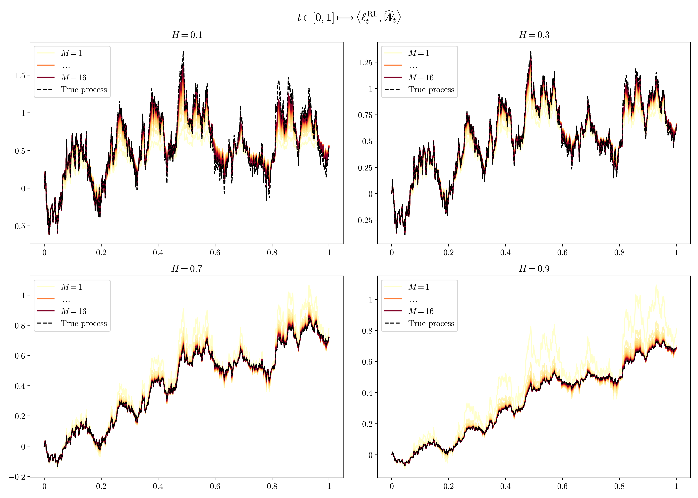
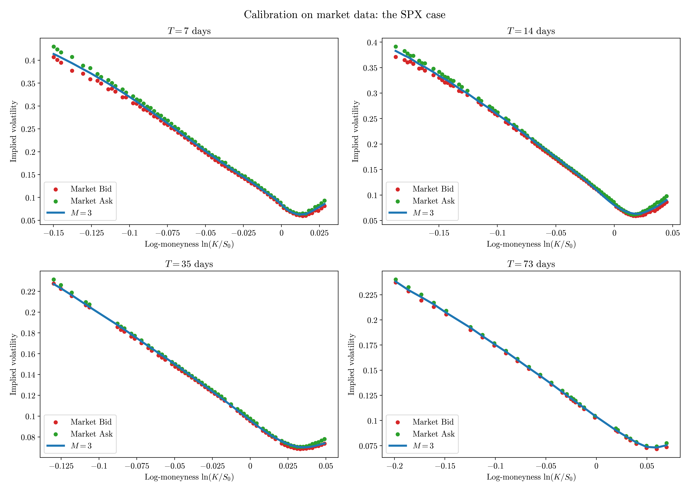
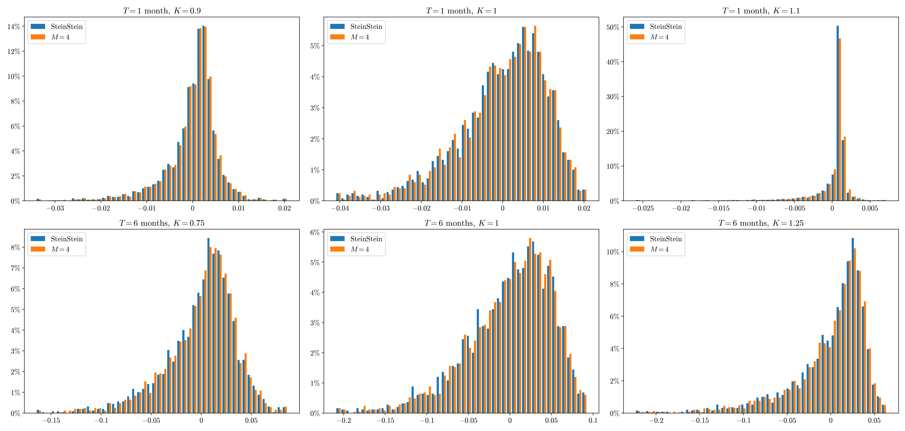

### Signature volatility models: pricing and hedging with Fourier 

This repository reproduces the results of  [Abi Jaber and Gérard (2025)](https://arxiv.org/pdf/2402.01820). 

We implement:
- exact characteristic function representations: OU, mGBM, CIR and path-dependent processes such as RL fBM (see `trajectories.ipynb`),
- an Elastic Net regression to estimate the coefficients of linear combinations of the time-augmented Brownian motion for non-signature payoffs (see `regression.ipynb`), 
- Fourier-based pricing of European, Asian options and $q$-volatility swaps (see `fourier_1.ipynb`), 
- calibration on synthetic models (Quintic Ornstein–Uhlenbeck diffusion) and market data (SPX) (see `fourier_1.ipynb`), 
- quadratic hedging by Fourier methods (see `fourier_2.ipynb`). 

In addition, we attach two technical notes: `heston_char_func.pdf`, which details the derivation of the Heston characteristic function (including the martingale justification), and `steinstein_char_func.pdf`, which covers the characteristic function in the Stein–Stein model.

### Examples of illustrations 

### Disclaimer 
Source code is available upon request. Please contact me directly. 